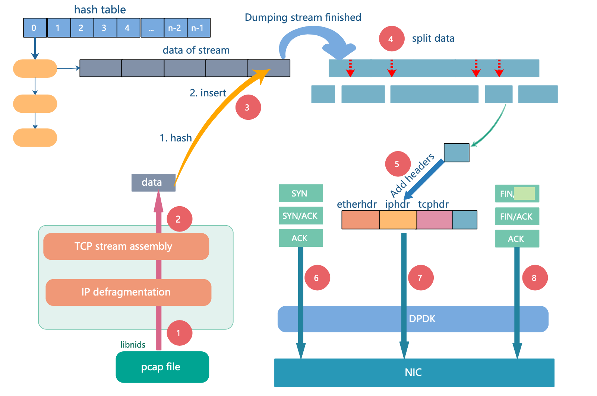

## streamGen

TCP stream generator



### Files

./   
 |__ main.c   
 |__ stream_gen.c   
 |__ string_matcher.c    
 |__ include/   
 |__ libnids-1.24/   
 |__ pcapfiles/  
 |__ Makefile   
 |__ setup.sh   
 |__ run.sh   
 |__ backup/ (Old version of streamGen)  

### Dependency

Intel-DPDK   
libpcap    
libnet    
libnids    
numa-devel   
kernel-devel

### Build

1. Set environment variables

Before building streamGen, you need to compile and deploy DPDK first. 

```bash
$ export RTE_SDK=<path-to-dpdk>
$ export RTE_TARGET=x86_64-native-linuxapp-gcc
```


2. Compile

```bash
$ cd <path-to-streamGen>
$ cd libnids-1.24/
$ make
$ make install
$ cd ..
$ make
Binary will be generated in build/
```

### Run

You may run "sudo ./build/streamGen -c 0x1 -n 1 -- -h" for help information.

To start streamGen, you need to give a pcap file as input, for example,

```bash
$ sudo ./build/streamGen -c 0x1 -n 1 -- -i pcapfiles/dump5.pcap -o 0 -c 100 -t 4 -r 10
```

```bash
-i <pcap file>	: Input file which provides network trace.
-o <interface>	: Interface used to send packets.
		(e.g. 1 for port1 with DPDK, eth1 for libpcap, default 0 which means sending with port0 bound to DPDK)
		Note, pcap_sendpacket() was deleted for latest version. 
			To send with pcap_sendpacket(), you may reference backup/with-pcap for details.
-c <concurrency>	: Concurrency when sending streams.(default 10)  
-t <thread>	: Number of sending threads (default 1, maximum 8) 
-r <proportion> : Proportion (x100) of fragmented packets (0 ~ 100, default 100)
```

### To run with Multiple threads

```bash
1. Uncomment "LIBS_CFLAGS += -DSEND_THREAD" in Makefile
2. Rebuild project
3. Option "-t" is used to set number of threads
```

### To enable dpdk-pdump 

(Not suggested. dpdk-pdump is to degrade performance)

```bash
1. Uncomment "LIBS_CFLAGS += -DUSE_PDUMP" in Makefile
2. Rebuild project
```

### To send with libpcap

```bash
 cd $ backup/with_pcap/
1. Comment "LIBS_CFLAGS += -DUSE_DPDK" in Makefile
2. Uncomment "LIBS_CFLAGS += -DUSE_PCAP" in Makefile
3. Rebuild project
4. You may run "./streamGen -h" for help information
```
### To simulate SYN flood

```bash
$ ./build/streamGen -c 0x1 -n 1 -- -i pcapfils/xx.pcap -o 0 -m 2
(-m : Running mode, default 1 for normal stream generation mode. 2 is given here for simulating SYN flood)
NOTE:
	To fix destination address, you may reference to '-f <dst file>' option, see dst_example.txt for example. 
```

### To generate stream with only one original TCP stream
```bash
1. Uncomment "LIBS_CFLAGS += -DSINGLE_STREAM" in Makefile
2. Rebuild project
```

### To dump stream data into seperate files 

```bash
1. Uncomment "#LIBS_CFLAGS += -DDUMP_PAYLOAD" and "#LIBS_CFLAGS += -DONLY_REQUEST " in Makefile
2. Rebuild and Run 
3. Stream data will be saved in files/ 
```

### To simulate without ACK packet
```bash
1. Uncomment "LIBS_CFLAGS += -DNO_ACK" in Makefile
2. Rebuild project
```

### To enable out-of-order generation
```bash
1. Uncomment "LIBS_CFLAGS += -DOOO_SEND" in Makefile
2. Rebuild project
```


## Q&A
